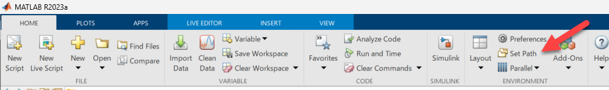

# サンプルコードの使い方

このサンプルはImage LabelerおよびVideo Labelerで、カスタムのラベリング自動化機能として、YOLOv4を使ったオブジェクト検出を利用する方法を示します。詳細はWebinarをご覧ください。

# 必要製品

   -  MATLAB 
   -  Image Processing Toolbox 
   -  Computer Vision Toolbox 
   -  Deep Learning Toolbox 

（mexコード生成する場合）

   -  MATLAB Coder 
   -  GPU Coder 

# 手順

下記が、YOLOv4を使って自動ラベリングを実行する手順です。

   1.  検出器の準備 
   1.  car_autolabeling_yolov4.mを編集 
   1.  ラベラーのカスタムオートメーション関数にcar_autolabeling_yolov4.mを登録 
   1.  実行 

この文書では、

   1.  検出器の準備 
   1.  car_autolabeling_yolov4.mを編集 

について詳しく解説します。

# 検出器の準備

カスタム関数の中では、検出器のmatファイルを呼び出して使っています。この呼び出すmatファイルを事前に準備しておく必要があります。

matファイルの事前準備には

`generate_YOLOv4cocodetector_as_matfile.m`

関数を実行します。関数は下記のように書かれています。

```matlab:Code(Display)
%% generate_YOLOv4cocodetector_as_matfile

detector = yolov4ObjectDetector('csp-darknet53-coco');
% detector = yolov4ObjectDetector('tiny-yolov4-coco');
save yolov4coco.mat detector

% Copyright 2023 The MathWorks, Inc.
```

デフォルトではcsp-darknet53-cocoを使うようになっていますが、コメントを入れ替えて'tiny-yolov4-coco'も使うことができます。使い分けの目安は

   -  精度重視、小さいオブジェクトを検出したい→csp-darknet53-coco 
   -  速度重視、大き目のオブジェクトを検出したい→tiny-yolov4-coco 

となります。

関数を実行後、現在のフォルダにyolov4coco.matができていることを確認してください。

# car_autolabeling_yolov4.mの編集

スクリプトは下記の通りです。

```matlab:Code(Display)
function autoLabels = car_autolabeling_yolov4(I)

% YOLOv4による検出の実行
% [bboxes,labels] = yolov4cocoDetect_mex(I); % mexファイルをコード生成した場合
[bboxes,labels] = yolov4cocoDetect(I); % mexファイルをコード生成してない場合

% 検出結果から'car'のみを抽出
car_idx = labels == 'car';
bboxes_car = bboxes(car_idx,:);
if ~isempty(bboxes_car) % carがあった場合
    numLabels = size(bboxes_car,1);
    for i = 1:numLabels % 自動ラベリング
        autoLabels(i).Name = 'car';
        autoLabels(i).Type = labelType('Rectangle');
        autoLabels(i).Position = bboxes_car(i,:);
    end
else % carが無かった場合
    autoLabels = []; % 空行列を返す
end

% Copyright 2023 The MathWorks, Inc.
```

編集する箇所は

```matlab:Code(Display)
% [bboxes,labels] = yolov4cocoDetect_mex(I); % mexファイルをコード生成した場合
[bboxes,labels] = yolov4cocoDetect(I); % mexファイルをコード生成してない場合
```

です。GPUとCoder製品があれば、YOLOv4のオブジェクト検出コード生成して高速に実行することが可能です。mexコード生成して高速化したラベリングを行いたい場合は、上の行のコメントを外して、下の行にコメントを付けてください。

## MEXコードの生成

MEXとは、Cなどのソースをコンパイルしてできた実行オブジェクトをMATLABから実行するためにラッピングしたものです。MATLABの関数を使うのと同じ書き方で高速な演算を行うことができます。

Coder製品があり、GPUを搭載したマシンを使える場合、ぜひMEXを生成してお使いください。

yolov4cocoDetect関数をMEX化するためのコードはyolov4cocoDetect_codegen.mの通りです。

```matlab:Code(Display)
% YOLOV4COCODETECT_CODEGEN   Generate MEX-function yolov4cocoDetect_mex from
%  yolov4cocoDetect.
% 
% Script generated from project 'yolov4cocoDetect.prj' on 31-Mar-2023.
% 
% See also CODER, CODER.CONFIG, CODER.TYPEOF, CODEGEN.

%% Create configuration object of class 'coder.MexCodeConfig'.
cfg = coder.gpuConfig('mex');
cfg.GenerateReport = true;
cfg.ReportPotentialDifferences = false;

%% Define argument types for entry-point 'yolov4cocoDetect'.
ARGS = cell(1,1);
ARGS{1} = cell(1,1);
ARGS{1}{1} = coder.typeof(uint8(0),[1080 1920   3],[1 1 0]);

%% Invoke MATLAB Coder.
codegen -config cfg yolov4cocoDetect -args ARGS{1}

```

下記の行の編集が必要です。

```matlab:Code(Display)
ARGS{1}{1} = coder.typeof(uint8(0),[1080 1920   3],[1 1 0]);
```

[1080 1920 3]は入力する画像のサイズを示しています。この場合はFull HD解像度の画像となります。ラベリングしたい画像のサイズを決めておく必要があり、お手持ちの画像を見てあらかじめサイズにあった処理ができるmexを生成します。適宜最初の2つの数値を書き換えてください。3番目の数値「3」は画像のチャンネル数でほとんどの場合RGBの3チャンネルですので、変更の必要はありません。

サイズを確認してyolov4cocoDetect_codegenを実行すると、mexが生成されます。

# その後の手順について

3と4の手順についてはWebinarをご覧ください。

カスタムオートメーション関数として使う際、yolov4cocoDetect.mにパスが通っていることを確認してください。現在のディレクトリにおいてあれば大丈夫です。違う場所に置いている場合、パスの設定で保存先のフォルダを指定してください。パスの設定は下記のとおり、MATLABの画面からアクセスできます。



Copyright 2023 The MathWorks, Inc.
